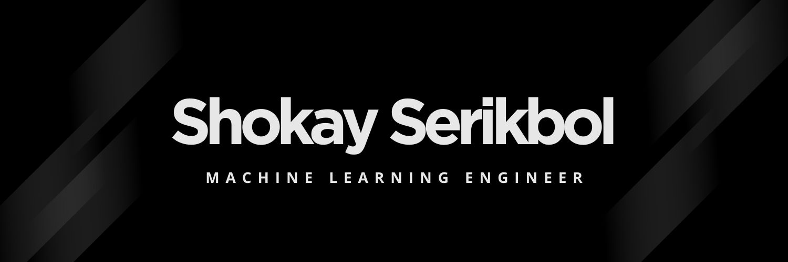

  

 

## 🛠 Tech Stack

**Languages**

  
  

**AI / Machine Learning & Data Science**

  
  
  
  
  
  

**Databases**

  
  
  
  

**DevOps, Cloud & Tools**

  
  
  
  

---

## 🌐 Connect with me

  
  

---

### 🐍 Contribution Activity

<picture>
  <source media="(prefers-color-scheme: dark)" srcset="https://raw.githubusercontent.com/SHOKinator/SHOKinator/output/github-snake-dark.svg">
  <source media="(prefers-color-scheme: light)" srcset="https://raw.githubusercontent.com/SHOKinator/SHOKinator/output/github-snake.svg">
  
</picture>
